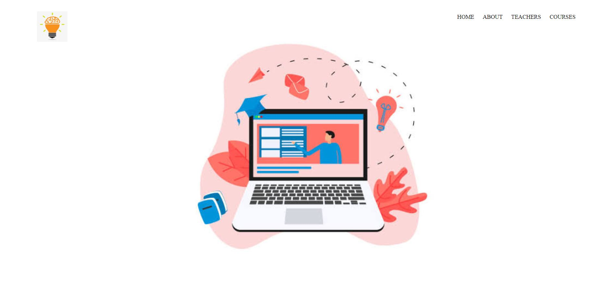
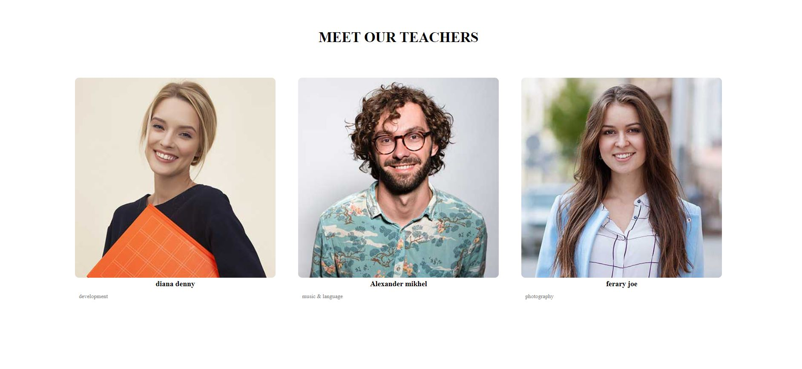
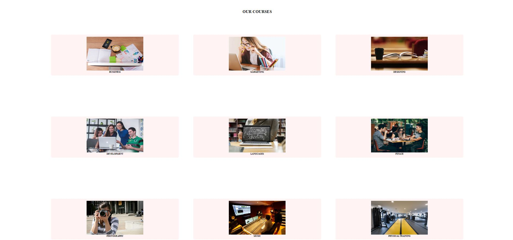
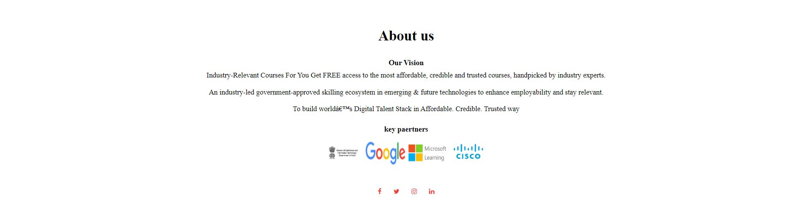

# ✨ online learning system.,   ✨

This is a web based application developed for a online learning.

### This web based learning application has been developed for the accomplishment of Future Ready Talent Internship program launched by Microsoft, Future Skills Prime, Quess, Github and EY.

**Project Link** - https://frt123.z13.web.core.windows.net/

**Demo Video** -  https://youtu.be/eg9E005udxE

## Features and Functionalities 😃

- Interactive and responsive UI.
- Has many graphical and visual innovative effects.
- Have an aesthetically pleasing visual design and architecture.
- Has collection of many web pages including Home, About , course,teacher etc.

## Screenshots 📸
### Home page -   

### Teachers page -

### Courses page -

### About Us Page -

## Tech Stack 💻

- [Azure(Hosting)](https://azure.microsoft.com/en-in/features/azure-portal/)
- HTML
- CSS

